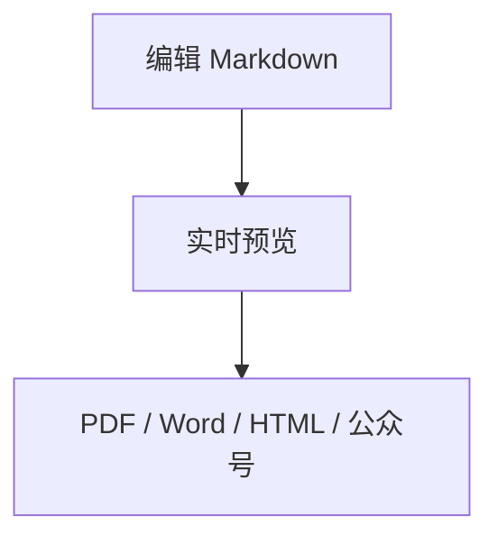

# fantastic-editor

作者：Tbin · 联系邮箱：niuboy5188@gmail.com

fantastic-editor 是面向 Windows 的本地优先 Markdown 编辑器，可打开单文件或文件夹工作区，编辑并预览包含本地图片与 KaTeX 公式的 Markdown，导出 PDF、Word、单文件离线 HTML，并支持微信公众号方案 B 兼容复制、官方 API 批量同步草稿和显式确认后的单篇发布。

主界面提供“新建”、多文档选项卡和窗口级拖拽打开；可一次拖入多个 `.md` / `.markdown` 文件，并在选项卡间保留各自未保存草稿。标签可拖动排序，也可用 Alt+Shift+左右键移动，恢复快照保持调整后的顺序。欢迎页显示最近文件，但 Renderer 只接收不透明 `recentId`、文件名和时间，不接收绝对路径。图片可拖到 CodeMirror 编辑区的具体位置，或通过“插入图片”按钮放到当前光标/选择区；应用将其安全复制到 Markdown 同级 `assets/`、插入相对引用并同步预览。界面包含资源管理器、欢迎页、可拖动编辑/预览分栏、编辑/分栏/预览三种视图、统一导出菜单，以及可记忆的浅色/深色主题、预览字体选择器和明确显示 ON/OFF 的“同步滚动”开关。开启后编辑区按 SourceRange 语义锚点驱动预览区；框选源码时，预览显示对应的块级范围提示框。状态栏显示当前快照的 Worker 解析和主进程资源解析耗时，大文档或慢任务使用分级提示。

编辑区可在“源代码”和“所见即所得”之间切换，选择会保存在本机。所见即所得模式复用预览主题和字体：标题与普通段落可直接编辑，并支持粗体、斜体、删除线、链接及标题级别；段落、列表项和表格单元格包含公式、图片、链接或行内代码时，也可直接编辑这些结构前后的普通文字，未触及的行内 Markdown 会逐字符保留；点击标准内联链接可分别修改显示文字、地址和可选标题，点击行内代码可修改内容并在反引号冲突时自动增长分隔符；Ctrl+B、Ctrl+I、Ctrl+K 可快速设置粗体、斜体和链接。Enter 新建段落、Shift+Enter 插入软换行，段首 Backspace 与段尾 Delete 可合并相邻的直接编辑块，点击文档空白处可创建新段落。纯文本粘贴会统一为 LF，中文输入法组合期间不会提前写回。普通/有序/任务列表项、引用段落和表格单元格也可直接编辑；列表项使用 Tab / Shift+Tab 调整一级层级，表格可用工具栏插入/删除行列、设置列对齐，并使用 Tab、Shift+Tab 或 Enter 切换单元格；在最后一个单元格按 Tab 会自动追加空白数据行。点击任务框可切换完成状态。用户还可跨标题、段落、引用和安全叶级列表项框选，执行删除、复制、剪切、多段纯文本粘贴，以及跨块粗体、斜体和删除线；一次操作对应一个撤销项，遇到图片、公式、代码、Mermaid、表格或其他受保护结构会在修改前拒绝。标准 Markdown 图片可在属性面板中修改 alt、替换或删除，替换继续走安全导入链路，删除只移除引用并保留 assets 原文件。公式使用带即时 KaTeX 预览的 LaTeX 面板，Mermaid 使用实时流程图源码面板，普通 fenced code block 可分别修改语言与代码内容。含子列表的父项可直接编辑自身正文，并可通过 Tab / Shift+Tab 或列表工具栏对当前项及全部子项执行缩进、提升和上下移动；含代码块、表格、块级公式或 Mermaid 后代的复杂列表仍通过精确绑定原文范围的源码卡片修改。合并/拆分单元格和 Wiki 图片也继续使用安全降级。选中结构块后可使用块工具栏上移、下移、复制、确认删除，或在下方插入常用 Markdown 块；也可拖动手柄或按 Alt+ArrowUp / Alt+ArrowDown 移动完整源码块。所有块操作保留原始空白并作为一个撤销项提交。两种模式共用 CodeMirror 的撤销/重做历史，保存和全部导出始终读取同一份 Markdown 原文。源代码和所见即所得复制均提供规范 Markdown 与安全 HTML 双格式；智能粘贴优先识别可信内部载荷和安全语义 HTML，无法安全转换时降级为纯文本。自动回归已完成，Word、IMA、浏览器和公众号之间的完整跨应用人工互拷仍属于 P1 验收项。

PDF 默认按 A4 纵向分页，处理标题孤页、表头重复、长代码换行和单页图片；导出前会等待字体与图片，并对过宽表格和公式进行可读范围内缩放，仍可能裁切时明确失败。

Word 导出同样固定 A4 页面，标题使用可编辑的 Word 标题样式；有序、无序和任务列表使用原生编号，表格使用确定性列宽、重复表头和行不拆分，正文、列表与表格均保持可编辑。离线 HTML 会内嵌 KaTeX 字体、样式和已授权图片，保留浅色/深色主题，支持响应式表格与长文本断行，并通过 CSP 和最终安全审计阻止脚本及本地临时地址。

公众号方案 B 提供发布验收助手：首个一级标题会作为公众号建议标题而不重复进入正文；普通图片、块级公式和 Mermaid 使用 `【FE类型NN｜整段替换】`，行内公式使用 `【FE公式NN｜行内替换】`。正文复制、替换图片复制和实际完成替换是三个独立状态；用户需确认图片出现且占位文字消失，再按顺序完成保存、重开和移动端预览。粘贴后不要再使用公众号“一键排版”，避免它覆盖列表和代码块样式。含批准省略的任务持续显示为部分完成，清单完成也不会被描述为已经发布。

公众号正文可选择“微信原生增强、极简墨白、深蓝科技”三套原创预置主题，也可从任一预置另存为不可变自定义主题。自定义面板只开放名称、强调色、正文色、页面色、标题色、15/16/17px 正文字号与左对齐/两端对齐；其余安全令牌继承基底，不接受 CSS、字体或任意样式。主题可保存到当前文章工作区或全局用户目录，并支持严格 JSON 导入、导出和未使用主题删除。主界面“公众号排版”使用唯一发布编译器提供 375px 默认手机预览及 320px、414px 宽度审计；所见即所得工具栏可选择是否实时投影当前公众号主题。主题只改变视图和输出排版，不修改 Markdown、sourceHash、ParsedDocument、图片/公式/Mermaid 替换顺序或任务完成状态；最终主题内容 ID 会写入人工验收记录。本地宽度审计不会自动确认真实公众号移动端验收。

在已生成公众号任务后，发布助手提供“一键同步到公众号草稿箱”和“一键发布到公众号”入口。两者都由主进程批量上传普通图片、公式 PNG 和 Mermaid PNG，替换微信持久图片 URL，上传封面并创建草稿，再回读校验；用户不需要逐张复制或粘贴。一键发布在明确二次确认后调用微信发布接口并轮询结果，只有确认成功才显示已发布。主界面顶部唯一的“公众号设置”入口可填写 AppID、AppSecret、选择默认封面并检测 IP 白名单；AppSecret 使用 Electron `safeStorage` 的系统加密保存，重新打开配置时不会回显明文。环境变量仅保留为开发兼容入口。当前产品固定为单账号、单篇发布，不开发多账号、群发或定时群发。没有 API 权限时仍可使用方案 B 兼容复制，但不应把后者称为多图一键发布。

主界面顶部常驻“公众号设置”入口。打开配置后，软件会使用微信接口检测凭据及 IP 白名单；若微信返回 `40164 invalid ip`，界面会显示并允许复制微信识别到的当前公网 IPv4，同时提示前往迁移后的微信开发者平台将其加入对应公众号的 IP 白名单。家庭或办公网络公网 IP 变化后，可在同一位置重新检测。

全部人工步骤完成后可保存一份隐私最小化的 Markdown 验收记录；主进程会校验终态任务和全部替换项。固定真实验收文章位于 fixtures/wechat-acceptance/standard.md，并配套本地 SVG 测试资源。

语言标识为 `mermaid` 的 fenced code block 会在实时预览中渲染为流程图。导出 PDF、Word、离线 HTML 或公众号内容时，应用在无网络的隔离 Chromium 窗口中生成 PNG 派生图，不在输出中携带 Mermaid 运行时脚本；公众号等位图输出在尺寸预算允许时使用最高 2 倍像素，提高移动端清晰度。内置字体包括微软雅黑、Segoe UI、Arial、等线、宋体和楷体；字体选择会保存在本机，并传给各导出适配器。

应用会在本地自动保存打开标签和未保存草稿的恢复快照。再次启动时自动恢复；若原文件已被外部修改，保存仍会触发冲突保护，若原文件已丢失则草稿以未命名文档恢复。

## 运行

需要 Node.js 24 或更高版本。

```powershell
npm install
npm start
```

`npm start` 会先执行生产构建，再启动 Electron 应用。日常开发使用：

```powershell
npm run dev
```

## Mermaid 示例

````markdown

````
## 验证

```powershell
npm test
npm run typecheck
npm run build
npm run dist:rc
npm run verify:portable
npm run verify:production
npm run verify:installer
npm audit --audit-level=high
```

当前源码版本：`0.3.0-rc.2`；52 个测试文件、264 项测试、严格类型检查和生产构建通过。公众号自定义主题仓库、严格内容身份、工作区/全局优先级、保存/导入/导出/删除、主界面实时预览、所见即所得主题投影、唯一发布编译器和最终只读安全审计均已进入最新 RC.2 安装包与便携包；Renderer 不读取主题文件、不解析自定义 ID。所见即所得支持直接切换字体/字号/阅读宽度并保持滚动位置，也可直接进入只读预览；主界面保留“查找/替换”入口，目录改为点击资源管理器中的当前 Markdown 文件名展开/收起。“打开的编辑器”中的已保存单文件以及工作区 `.md`/`.markdown` 文件均支持右键重命名；所见即所得支持 Ctrl+A 后删除整篇正文且可撤销。IMA 风格粘贴会在安全语义 HTML 不完整时保留较完整的纯文本，修复重复 Markdown 转义、嵌套列表和有序列表起始编号；剪贴板源本身未包含的内容无法恢复。主界面的“修复网页 Markdown”可由用户显式修复结构性转义、过量空行和表格行间空白。

## 使用边界

- `0.2.0-rc.3` 公众号兼容入口采用方案 B：正文和样式一次复制，图片、公式及 Mermaid 生成短编号占位，再由替换助手逐项复制。应用不会把该流程称为“带图一键发布”，也不会建议粘贴后再次套用公众号“一键排版”。
- `0.3.0` 已接入官方 API 批量同步草稿和显式确认后一键发布；公众号第三方平台授权、多账号、群发和定时群发仍不在当前范围。
- 源 Markdown data URI 固定阻止；导出 Data URI 只能从主进程已授权并重新校验的本地资源字节生成。
- 单篇文档编辑上限为 1,000 万字符，打开/保存的 Markdown 文件上限为 40 MiB；单篇最多解析 10,000 个资源引用，单资源上限 50 MiB，单次解析/导出的去重图片与公式资源总预算为 200 MiB，单次需图片化的公式最多 500 项。超过边界会明确失败或产生阻断诊断，不会静默截断。
- 大文档输入会自适应延长解析与恢复快照防抖；新解析会终止旧 Worker，恢复写入只保留最新待写快照，重复图片按内容哈希复用导出字节。
- 图片导入支持 PNG、JPEG、GIF、WEBP、SVG。未命名文档先另存为；主进程校验文件签名、容量和工作区身份，文件使用“安全化名称 + 内容哈希”写入 `assets/`。撤销 Markdown 引用不会自动删除图片文件。
- 同步滚动 P0 为“编辑区 → 预览区”单向模式；预览主动滚动不会反向移动编辑器。选区提示为块级语义范围，不承诺将 Markdown 标记符逐字符映射到预览文字。
- 所见即所得第一至第十二轮已冻结为 P0 编辑基线；后续新增语法或高级编辑能力进入 P1，当前开发主线转向导出与公众号真实环境验收。
- 所见即所得当前直接编辑标题、普通段落、安全列表项（包括含纯列表后代的父项正文）、引用段落和表格单元格，并提供标准 Markdown 图片的 alt、替换和删除面板；列表结构命令以整棵子树为单位支持缩进、提升、上下移动、同级新增和空项退出。表格支持行列插入/删除、列对齐和末格 Tab 追加行，但不支持合并或拆分单元格。公式、Mermaid、普通 fenced code block、标准内联链接和行内代码使用专用结构化面板；含子块的父列表项、任意复杂嵌套结构、Wiki 图片及其他未冻结复杂块使用源码卡片。所有写回都校验原文快照和 SourceRange，旧快照会被拒绝；当前 Markdown 的新解析完成前也不会重绘旧 HTML，更不会整篇反序列化可编辑 HTML。跨块删除、剪切、直接输入、Enter、多段纯文本粘贴和粗体/斜体/删除线仅支持标题、普通段落、引用段落及安全叶级列表项；表格、图片、公式、代码、Mermaid、源码卡片、受保护行内原子和已有格式节点内端点会在提交前拒绝，并提示缩小范围或改用源代码模式。
- 混合换行不会静默统一；打开时必须选择 LF 或 CRLF。非 UTF-8 文件会显示 GBK/GB18030 候选预览，只有明确确认后才转换为 UTF-8，并立即标记为未保存。
- 真正的公众号草稿持久化、跨端预览仍只能在目标平台人工验收。跨机器 PDF/Word 差异可作为以后兼容性抽检，不再作为当前本机发布加固的阻断项。

## 工作区

- `packages/document-core`：唯一 Markdown 解析与 UDM 语义来源。
- `packages/shared`：可结构化克隆的共享类型和最小 IPC 契约。
- `apps/desktop`：Electron 主进程、sandboxed Renderer、隔离公式/PDF 窗口和 Utility Process 输出适配器。

详细规格见项目根目录的三份开发文档；当前实现状态见 `fantastic-editor-开发进度.md`。`npm run dist:portable` 会生成便携版并执行产物、隐私及生产态验证；`npm run dist:rc` 会生成安装版、便携版和完整清单，再执行产物、隐私、7 组生产态与安装/卸载门禁。两种产物均使用正式绿色 `f` 图标。公众号 AppID、AppSecret、封面路径和 IP 信息不会写入安装包或便携包，用户只能在安装后应用内单独配置；AppSecret 仅以 Windows 系统加密值保存。正式签名发布使用 `npm run dist:signed`：它先验证 PFX 或 Windows 证书存储中的代码签名身份，强制 RFC 3161 时间戳，构建后要求安装版和便携版的 Authenticode 状态均为 `Valid`，否则整个发布失败。证书文件与密码只能通过本机证书存储或环境变量提供，不得提交仓库。

当前最新产物为 `release/fantastic-editor-0.3.0-rc.2-portable.exe` 和 `release/fantastic-editor-0.3.0-rc.2-setup.exe`；两者包含本轮公众号自定义主题、主界面排版入口、所见即所得主题投影、自定义字体修复和主题删除修复。隐私扫描、便携隔离启动、basic/PDF/DOCX/离线 HTML/公式/Mermaid/UI 七组生产冒烟及安装—启动—卸载门禁全部通过，签名状态均为 `NotSigned`。安装版为 136,690,113 字节，SHA-256 `DD45E7A9012329340C4C10BE8C43F0488C112B0309CB744A0800F7A08998E2EE`；便携版为 136,432,037 字节，SHA-256 `A2643D21805C9DB6BF239A1D36B7A67948EAA692D85374A9298D99D513035F16`。RC.1 及 `0.2.0-rc.*` 历史产物继续保留，不被覆盖。

公众号逐主题真实验收状态仍以已归档记录为准：微信原生增强有 `rc.2` 历史记录，深蓝科技有 `rc.1` 历史记录；当前 RC.2 新主题产物尚未完成三套主题逐套真实平台复验，因此不能标记为公众号三主题兼容性正式验收完成。
